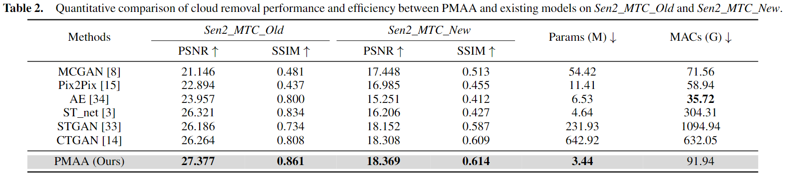

<p align="center">
    
<h1 align="center">PMAA: A Progressive Multi-scale Attention Autoencoder Model for High-Performance Cloud Removal from Multi-temporal Satellite Imagery</h1>
<p align="center">This repository is the official PyTorch implementation of the accepted paper PMAA of ECAI 2023.
</p>
</p>
<p align="center">
    <a href="https://blog.csdn.net/qq_42951560">Xuechao Zou<sup>1,*</sup></a>,
    <a href="https://cslikai.cn/">Kai Li<sup>2,*</sup></a>,
    <a href="https://www.cs.tsinghua.edu.cn/info/1116/5088.htm">Junliang Xing<sup>2</sup></a>,
    <a href="https://www.cs.tsinghua.edu.cn/info/1117/3542.htm">Pin Tao<sup>1,2,†</sup></a>,
    <a href="https://cs.qhu.edu.cn/jxgz/jxysz/szgk/22173.htm">Yachao Cui<sup>1</sup></a>
</p>

<p align="center">
    <a href="https://www.qhu.edu.cn/">Qinghai University</a><sup>1</sup>
    •
    <a href="https://www.tsinghua.edu.cn/">Tsinghua University</a><sup>2</sup>
  </p>
  <p align="center">
    <a href="https://arxiv.org/abs/2303.16565">Paper Preprint </a>
    |
    <a href="https://xavierjiezou.github.io/PMAA">Project Page</a>
</p>

<p align="center">
<!-- Optional: include a graphic explaining your approach/main result, bibtex entry, link to demos, blog posts and tutorials -->


<!--  -->
</p>

## News

- [2023/07/30] Code release.
- [2023/07/16] PMAA got accepted by ECAI 2023.
- [2023/03/29] PMAA is on arXiv now.

## MAJOR UPDATE FOR ALLCLEAR
1. Update `from skimage.measure import compare_psnr, compare_ssim` with `from skimage.metrics.peak_signal_noise_ratio` and `skimage.metrics import structural_similarity`; change the code `ssim = compare_ssim(cloudfree, predict, multichannel = True, channel_axis=2)` accordingly.

## Requirements

To install dependencies:

```setup
pip install -r requirements.txt
```

<!-- >📋  Describe how to set up the environment, e.g. pip/conda/docker commands, download datasets, etc... -->

To download datasets:

- _Sen2_MTC_Old_: [multipleImage.tar.gz](https://doi.org/10.7910/DVN/BSETKZ)

- _Sen2_MTC_New_: [CTGAN.zip](https://drive.google.com/file/d/1-hDX9ezWZI2OtiaGbE8RrKJkN1X-ZO1P/view?usp=share_link)

## Training

To train the models in the paper, run these commands:

```train
python train_old.py
python train_new.py
```

<!-- >📋  Describe how to train the models, with example commands on how to train the models in your paper, including the full training procedure and appropriate hyperparameters. -->

## Evaluation

To evaluate my models on two datasets, run:

```eval
python test_old.py
python test_new.py
```

<!-- >📋  Describe how to evaluate the trained models on benchmarks reported in the paper, give commands that produce the results (section below). -->

## Pre-trained Models

You can download pretrained models here:

- Our awesome model trained on _Sen2_MTC_old_: [pmaa_old.pth](/pretrained/pmaa_old.pth)
- Our awesome model trained on _Sen2_MTC_new_: [pmaa_new.pth](/pretrained/pmaa_new.pth)

<!-- >📋  Give a link to where/how the pretrained models can be downloaded and how they were trained (if applicable).  Alternatively you can have an additional column in your results table with a link to the models. -->

## Results


### Quantitative Results



### Qualitative Results


<!-- >📋  Include a table of results from your paper, and link back to the leaderboard for clarity and context. If your main result is a figure, include that figure and link to the command or notebook to reproduce it.  -->

<!-- ## Contact

If you have any questions, please contact: xuechaozou@foxmail.com -->

## Citation

If you use our code or models in your research, please cite with:

```latex
@article{zou2023pmaa,
  title={PMAA: A Progressive Multi-scale Attention Autoencoder Model for High-Performance Cloud Removal from Multi-temporal Satellite Imagery},
  author={Zou, Xuechao and Li, Kai and Xing, Junliang and Tao, Pin and Cui, Yachao},
  journal={European Conference on Artificial Intelligence (ECAI)},
  year={2023}
}
```

<!-- >📋  Pick a licence and describe how to contribute to your code repository.  -->
